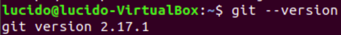

GIT ET GITHUB

I QU’EST CE QUE GIT ?

Git ===>	- VCS (Version Control System),
		- Pour gérer tous nos projets,
		- Pour tracker les différents changements apportés à un projet spécifique.

===> C’est un outil qui apporte de gérer nos projets.
===> GitHub = C’est une plateforme qui permet d’héberger nos différents projets.

Pourquoi ?
		- collaboration,
		- historique des différentes versions,
		- développement en parallèle.

Comment ?
		- Création d’un compte sur GitHub
(https://git-scm.com/book/fr/v2/GitHub-Configuration-et-param%C3%A9trage-d%E2%80%99un-compte),
		- Installation de Git en local (https://desktop.github.com/)
		- Environnement de travail
Avec un projet (avec un dossier et des fichiers), un éditeur de texte et un terminal

	

II PREMIERS PAS SUR GIT

Initialisation du projet :

Avec Git init, git va créer un fichier caché « git » dans le dossier (en fichier caché) [CTRL H pour afficher les fichiers cachés sur Linux ]qui permettra de pusher les fichiers vers Github.

Identification sur Git :

Il faut ensuite s’identifier sur Git pour pouvoir continuer à utiliser toutes les commandes.

Exemple de sauvegarde d’un fichier sur GitHub :

Dans un premier temps, il faut pré-sauvegarder le fichier grâce à « git add NomDuFichier » puis avec la commande « guide status », on affichera la liste de tous les fichiers pré-sauvegardés.

Pour annuler cette opération,il faut comme c’est indiqué au-dessus, utiliser la commande 
« git rm –cached NomDuFichier ».

Attention de ne pas oublier les deux tirets avant « cached » sans cela, le fichier sera supprimé.

Pour annuler une suppression ou tout autre changement, la commande « checkout » peut être utilisée.

A la fin, pour finaliser la pré-sauvegarde, il suffit d’utiliser la commande « commit »
Une page vim s’ouvre et demande un message de validation, ici « Première sauvegarde ».
Vim est un éditeur de texte, c'est-à-dire un logiciel permettant la manipulation de fichiers texte.
Un CTRL X ferme vim.

Enfin, avec la commande « commit -m « mise à jour », les fichiers sont enregistrés.

La commande « gitignore » :

https://perhonen.fr/blog/2015/03/exclure-fichiers-depot-git-gitignore-1476

En fait, ce n’est pas une commande mais un fichier en faisant : 
⇒ touch .gitignore

Il suffira d’y inscrire les noms des fichiers que nous voulons exclure des git car trop sensibles par exemple.
EX : .test/ (Ne pas oublier le point au début et le slash à la fin)

En faisant ls, le fichier .gitignore n’apparaît pas.

III LES BRANCHES

https://git-scm.com/book/fr/v2/Les-branches-avec-Git-Les-branches-en-bref
En faisant « git status », nous pouvons vérifier que nous sommes bien sur la branche master.

Création d’une nouvelle branche :

Pour aller sur cette nouvelle branche, il suffit de faire « git checkout NomNouvelleBranche ».

Pour savoir dans quelle branche, nous sommes, il faut utiliser la commande « git branch --list ».
Ne pas mettre d’espace entre les deux tirets et le nom de la branche, sinon une nouvelle branche sera créée.
L’étoile devant le nom de la branche indiquera dans quelle branche nous nous situons.

IV REPOSITORY SUR GITHUB

