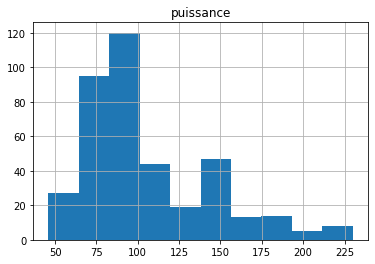
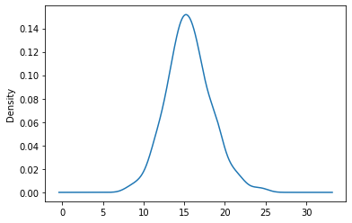
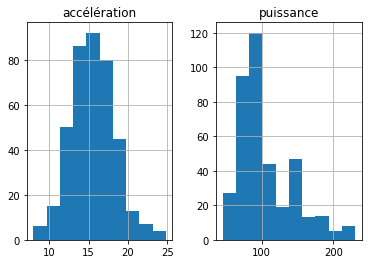
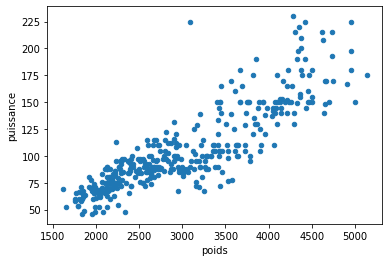
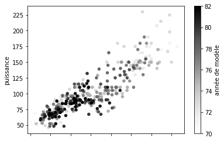
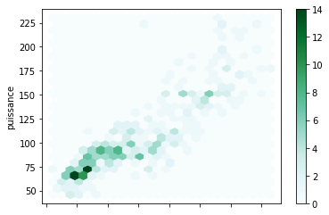
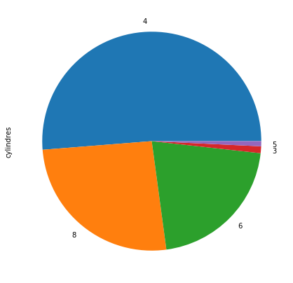

```python
import pandas as pd
# on creer une dataframe "df" mais ici moi je le nome "auto", on creer une liste qui est les noms des colonnes et on l'ajoute lors de la création de la dataframe "auto"
liste=["mpg","cylindres","déplacement","puissance","poids","accélération","année de modèle","origine","nom de la voiture"]
auto=pd.read_excel('/home/ines/Téléchargements/autompg.xlsx', set='\t',names=liste)

print (auto)
```

          mpg  cylindres  déplacement  puissance  poids  accélération  \
    0    18.0          8        307.0      130.0   3504          12.0   
    1    15.0          8        350.0      165.0   3693          11.5   
    2    18.0          8        318.0      150.0   3436          11.0   
    3    16.0          8        304.0      150.0   3433          12.0   
    4    17.0          8        302.0      140.0   3449          10.5   
    ..    ...        ...          ...        ...    ...           ...   
    393  27.0          4        140.0       86.0   2790          15.6   
    394  44.0          4         97.0       52.0   2130          24.6   
    395  32.0          4        135.0       84.0   2295          11.6   
    396  28.0          4        120.0       79.0   2625          18.6   
    397  31.0          4        119.0       82.0   2720          19.4   
    
         année de modèle  origine          nom de la voiture  
    0                 70        1  chevrolet chevelle malibu  
    1                 70        1          buick skylark 320  
    2                 70        1         plymouth satellite  
    3                 70        1              amc rebel sst  
    4                 70        1                ford torino  
    ..               ...      ...                        ...  
    393               82        1            ford mustang gl  
    394               82        2                  vw pickup  
    395               82        1              dodge rampage  
    396               82        1                ford ranger  
    397               82        1                 chevy s-10  
    
    [398 rows x 9 columns]


```python
# descriptives des données
print (auto.describe(include='all'))
```

                   mpg   cylindres  déplacement   puissance        poids  \
    count   398.000000  398.000000   398.000000  392.000000   398.000000   
    unique         NaN         NaN          NaN         NaN          NaN   
    top            NaN         NaN          NaN         NaN          NaN   
    freq           NaN         NaN          NaN         NaN          NaN   
    mean     23.514573    5.454774   193.425879  104.469388  2970.424623   
    std       7.815984    1.701004   104.269838   38.491160   846.841774   
    min       9.000000    3.000000    68.000000   46.000000  1613.000000   
    25%      17.500000    4.000000   104.250000   75.000000  2223.750000   
    50%      23.000000    4.000000   148.500000   93.500000  2803.500000   
    75%      29.000000    8.000000   262.000000  126.000000  3608.000000   
    max      46.600000    8.000000   455.000000  230.000000  5140.000000   
    
            accélération  année de modèle     origine nom de la voiture  
    count     398.000000       398.000000  398.000000               398  
    unique           NaN              NaN         NaN               305  
    top              NaN              NaN         NaN        ford pinto  
    freq             NaN              NaN         NaN                 6  
    mean       15.568090        76.010050    1.572864               NaN  
    std         2.757689         3.697627    0.802055               NaN  
    min         8.000000        70.000000    1.000000               NaN  
    25%        13.825000        73.000000    1.000000               NaN  
    50%        15.500000        76.000000    1.000000               NaN  
    75%        17.175000        79.000000    2.000000               NaN  
    max        24.800000        82.000000    3.000000               NaN  


```python
# accès à une ou plusieurs colonnes
print (auto[['poids','mpg']])
# ou une autre méthode
print (auto.poids)
```

         poids   mpg
    0     3504  18.0
    1     3693  15.0
    2     3436  18.0
    3     3433  16.0
    4     3449  17.0
    ..     ...   ...
    393   2790  27.0
    394   2130  44.0
    395   2295  32.0
    396   2625  28.0
    397   2720  31.0
    
    [398 rows x 2 columns]
    0      3504
    1      3693
    2      3436
    3      3433
    4      3449
           ... 
    393    2790
    394    2130
    395    2295
    396    2625
    397    2720
    Name: poids, Length: 398, dtype: int64


```python
# calculer la moyenne 
print (auto['mpg'].mean())
print (auto.iloc[14,1]) # affiche la case qui se trouve à la 14ème ligne et la colonne 1
```

    23.514572864321615
    4


```python
import matplotlib.pyplot as plt # pour afficher les graphes
# affiche un histogramme 
auto.hist(column='puissance') #type de donnée quantitative continue
```


    array([[<matplotlib.axes._subplots.AxesSubplot object at 0x7ff68049f6d0>]],
          dtype=object)





```python
auto['accélération'].plot.kde() 
```


    <matplotlib.axes._subplots.AxesSubplot at 0x7ff680464b50>





```python
auto.hist(column=['puissance','accélération'])
```


    array([[<matplotlib.axes._subplots.AxesSubplot object at 0x7ff67a7fef10>,
            <matplotlib.axes._subplots.AxesSubplot object at 0x7ff67a824b90>]],
          dtype=object)





```python
auto.plot.scatter(x='poids',y='puissance')
```


    <matplotlib.axes._subplots.AxesSubplot at 0x7ff67a6dca10>





```python
auto.plot.scatter(x='poids',y='puissance',c='année de modèle')
```


    <matplotlib.axes._subplots.AxesSubplot at 0x7ff67a6406d0>





```python
auto.plot.hexbin(x='poids',y='puissance',gridsize=25)
```


    <matplotlib.axes._subplots.AxesSubplot at 0x7ff67a5a5650>





```python
plt.figure(figsize=(7,9))# pour agrandir le diagramme circulaire
auto['cylindres'].value_counts().plot.pie()
```


    <matplotlib.axes._subplots.AxesSubplot at 0x7ff67893d490>




